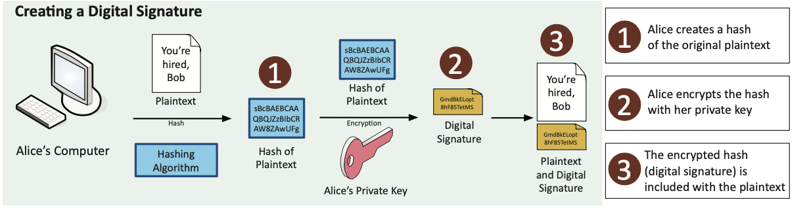
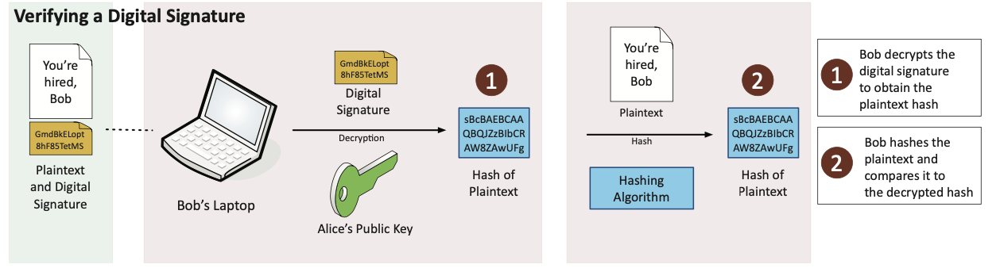

# 🛡️ 1.2 – Non-repudiation

📚 Based on Professor Messer – Non-repudiation (7:57)

---

## 🎯 What Is Non-repudiation?

**Non-repudiation** is a security concept that ensures a person **cannot deny** having performed an action, such as sending a message, signing a document, or performing a transaction.

> 🧠 Think of it as a **digital “you said it, you own it”**.

In the real world, this is like signing a contract:
- ✍️ Your signature proves **you signed** it.
- 🧾 Others can verify that signature.
- ❌ You cannot later deny your involvement.

In cybersecurity, non-repudiation provides:
- **Proof of integrity** – The data hasn’t been altered.
- **Proof of origin** – It came from who claims to have sent it.

---

## 🧪 Proof of Integrity (via Hashing)

To verify that data has not changed, we use a **hashing algorithm**:
- A **hash** is a short string that uniquely represents a file or message.
- If even **one character** changes, the hash output will change drastically.
- This makes hashes ideal for detecting **tampering or corruption**.

> Hash = a **digital fingerprint** of the data.

### Example:
- File: *Gutenberg Encyclopedia, Vol 1* (8.1 MB)
- Change one character → the hash is completely different
- Result: The integrity has been compromised

Note: Hashes alone **do not associate data with a person** — they only verify whether the data changed.

---

## 🔐 Proof of Origin (via Digital Signatures)

Hashing is combined with **digital signatures** to also verify **who** sent the message:

### ✅ How It Works:
1. The sender **hashes** the message.
2. The hash is **encrypted with the sender’s private key** — this becomes the **digital signature**.
3. The recipient can **decrypt** the signature using the sender’s **public key**.
4. The recipient also hashes the original message and compares both hashes.

If the hashes match:
- ✅ The message is **unchanged**.
- ✅ The message was signed by the **legitimate sender**.
- ✅ The sender **cannot deny** signing it.

---

## 🔏 Why It Matters

Digital signatures provide **three critical assurances**:
- 🧾 **Integrity** – Message was not altered.
- 👤 **Authentication** – Confirms the identity of the sender.
- 🚫 **Non-repudiation** – Sender cannot deny they sent it.

> Only someone with the **private key** could have signed the message.  
> Only someone with the **public key** can verify that it’s valid.

---

---

## 🖼️ Visual Summary

### Creating a Digital Signature

### Verifying a Digital Signature

✅ Return to [Domain 1 Overview](./README.md)
