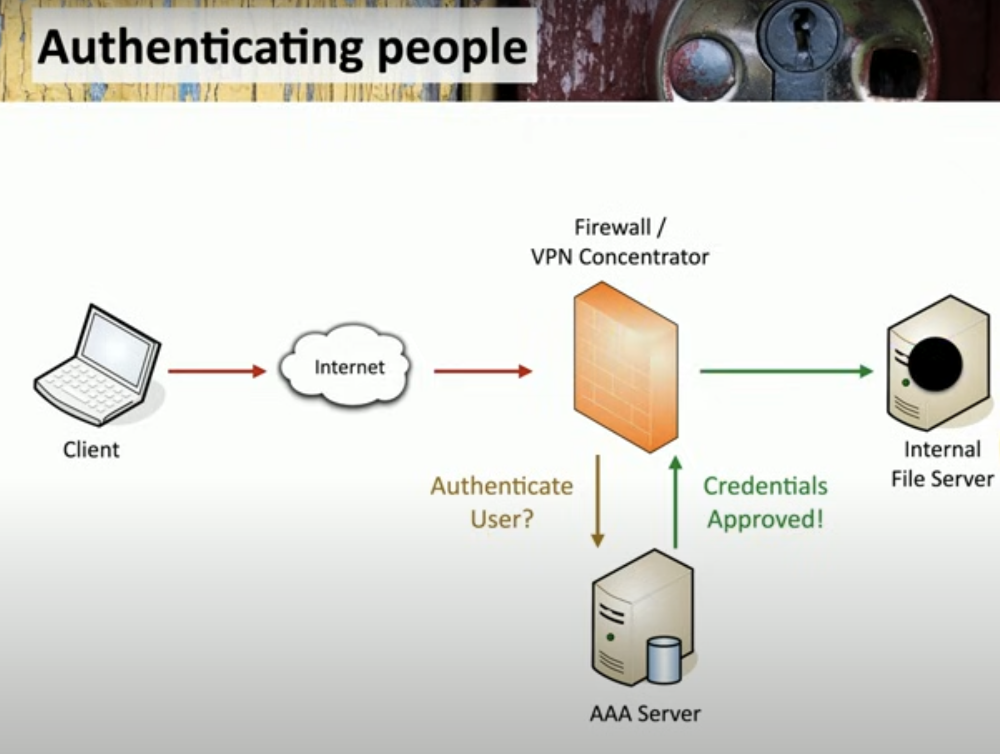

# 🔐 1.2 – Authentication, Authorization, and Accounting (AAA)

📚 Based on Professor Messer – AAA Framework

---

## 🎯 Overview

The **AAA framework** defines a structured approach for managing user and system access:

- **Identification** – Who are you?
- **Authentication** – Prove it.
- **Authorization** – What can you do?
- **Accounting** – What did you do?

> 🧠 Think of it like checking into a hotel:
> - ID = your passport
> - Authentication = matching your face to the photo
> - Authorization = you get access to your room
> - Accounting = they log your check-in/out and any minibar use

---

## 🧾 The AAA Breakdown

### 🧍 Identification

- The **claim** of who you are (e.g., username)
- Comes **before** any proof is required

### 🔑 Authentication

- **Verification** of identity using credentials
- Common methods:
  - Passwords
  - Biometrics
  - Smart cards
  - OTPs (One-Time Passwords)

### 🧭 Authorization

- Determines **what resources you can access**
- Based on your identity and successful authentication
- Example: Admin users can access system settings; guests cannot

### 📊 Accounting

- **Tracks activity** on the system
- Examples:
  - Login and logout timestamps
  - Data transferred
  - Resources accessed

---

## 🖼️ AAA Authentication Flow Diagram

This image illustrates how a user is authenticated before gaining access to internal resources:

---

## 🖥️ Authenticating Systems (Not Just Humans)

- Devices like switches, printers, or IoT gadgets **can't enter passwords**
- Instead, they use **certificate-based authentication**

### ✅ Certificate Authentication

- Organizations act as their own **Certificate Authority (CA)**
- Devices are issued a **digitally signed certificate**
- That certificate is used to:
  - Authenticate the device automatically
  - Grant access to secure resources (e.g., VPN, network tools)

> 🔐 This method is secure, scalable, and removes the need for passwords.

---

## 🧾 Authorization Models

Once **authentication** is complete, the system must determine:  
**What is this user or device allowed to access?**

That’s where **authorization models** come into play.

---

## 🚫 No Authorization Model (Direct Mapping)

- A basic setup:
- User → Resource

- Directly assigns access rights per user
- Works for **very small** environments
- ❌ Not scalable  
❌ Becomes confusing with many users or resources

---

## ✅ Using an Authorization Model (Abstraction Layer)

To solve scaling and management issues, organizations insert an **authorization model** between users and resources.

### 🧱 What Does the Model Do?

- **Adds abstraction**:  
Users aren’t mapped directly to resources — they’re mapped through rules or roles.
- **Simplifies administration**:  
Easy to manage and review access rights.
- **Supports scalability**:  
Works with **many users**, **devices**, and **systems**.

---

### 📊 Types of Authorization Models

| Model Type     | Description                                             |
|----------------|---------------------------------------------------------|
| **RBAC**       | Role-Based Access Control – Access based on job role    |
| **ABAC**       | Attribute-Based Access Control – Based on user/device/data attributes |
| **Org-Based**  | Based on department, team, or organization groupings    |

---

### ⚠️ Challenges

While authorization models solve complexity, they introduce new issues:
- 🔍 It can be **difficult to trace** why someone has access to something
- 🧩 Some models (especially attribute-based) are **complex to audit**
- ⚙️ Poorly designed models **don’t scale well**

---

## ✅ Summary

| Without Model              | With Authorization Model                 |
|----------------------------|------------------------------------------|
| User ↔ Resource            | User → Model → Resource                  |
| ❌ Doesn’t scale            | ✅ Scales well                           |
| ❌ Hard to manage manually  | ✅ Easier to administer and review       |

---

✅ Return to [Domain 1 Overview](./README.md)
